# SafeBite UML - Mermaid Diagrams

## 1. Main System Flowchart (Mermaid)

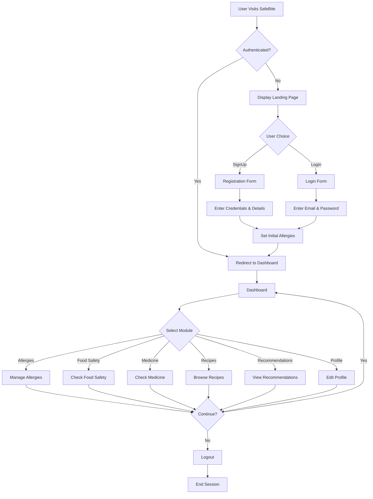

## 2. Allergy Management Flow

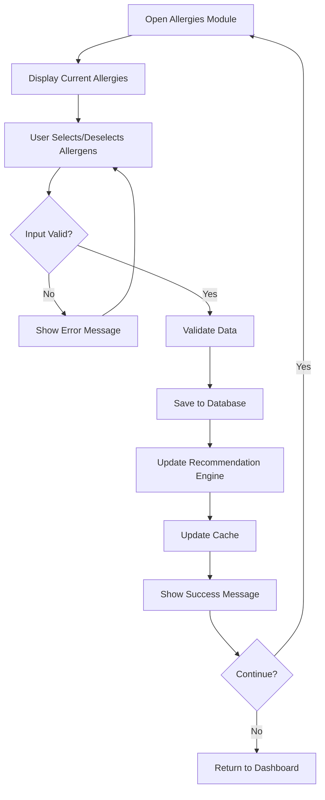

## 3. Food Safety Checker Flow

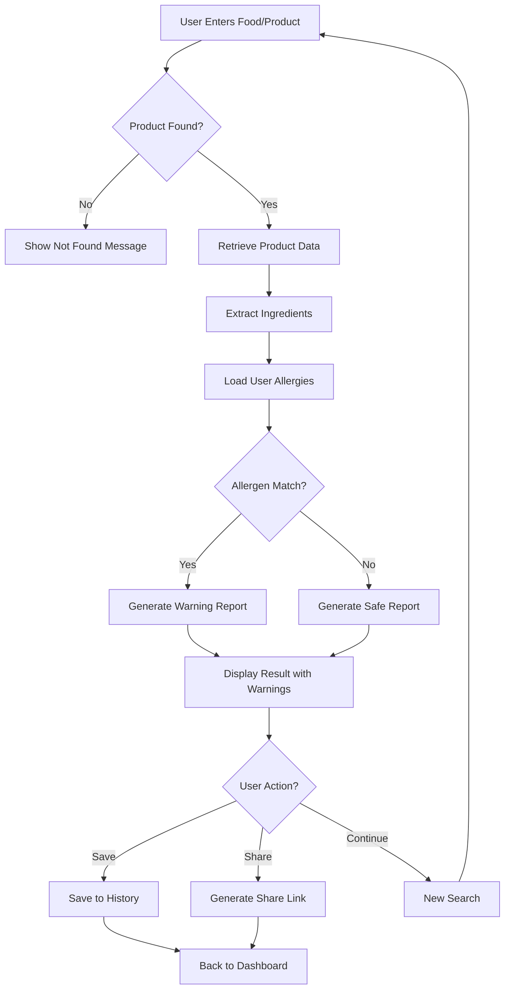

## 4. Medicine Checker Flow

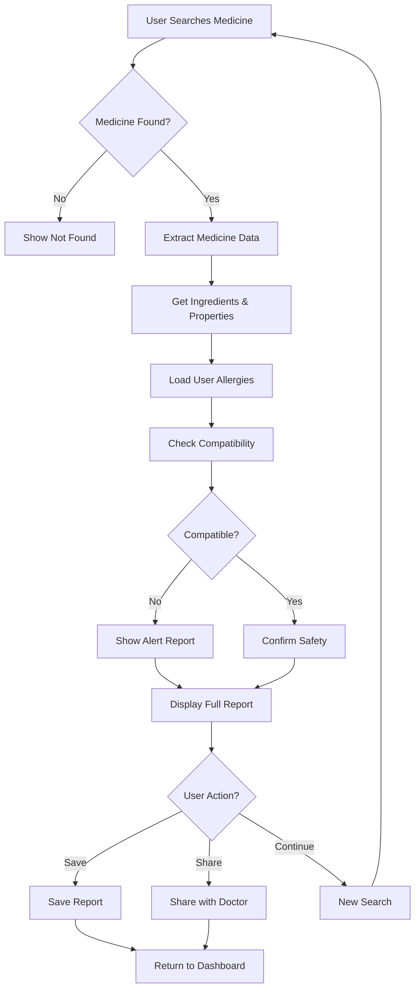

## 5. Recipe Discovery Flow

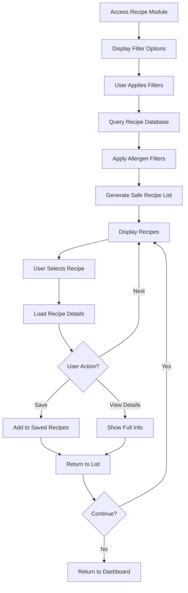

## 6. Recommendation Engine Flow

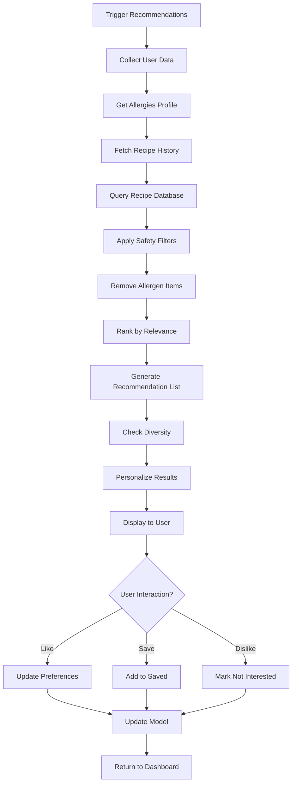

## 7. User Authentication Flow

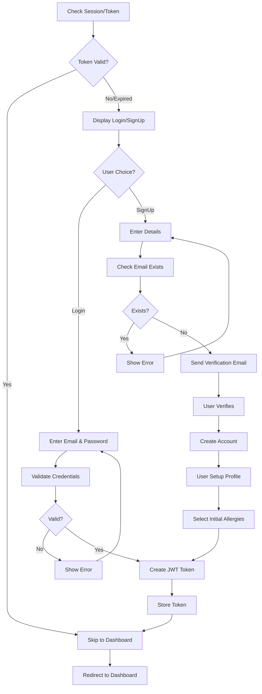

## 8. Class Diagram

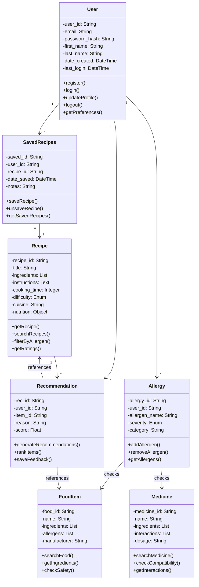

## 9. Entity Relationship Diagram

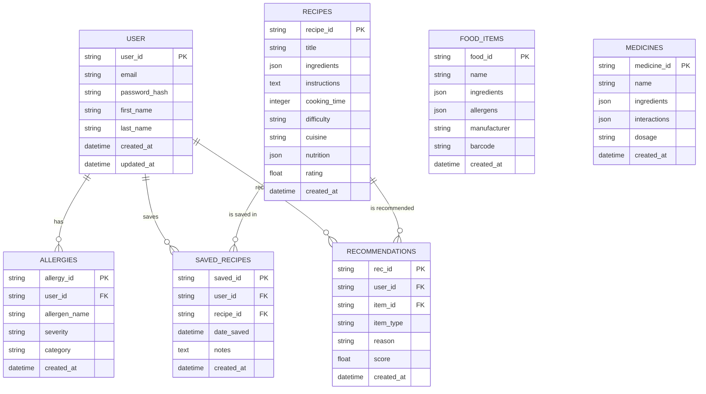

## 10. State Diagram - User Session

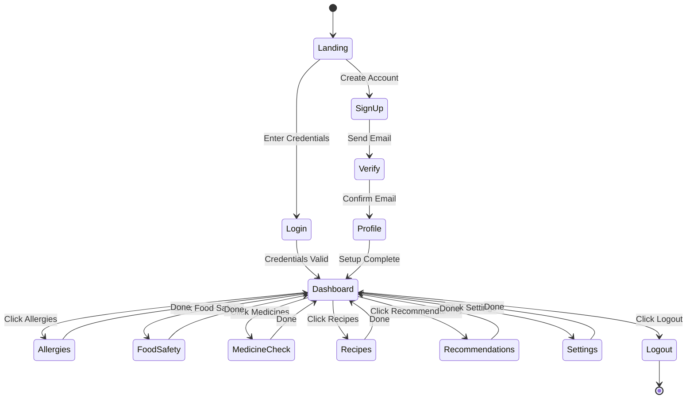

## 11. Sequence Diagram - Complete Food Safety Check

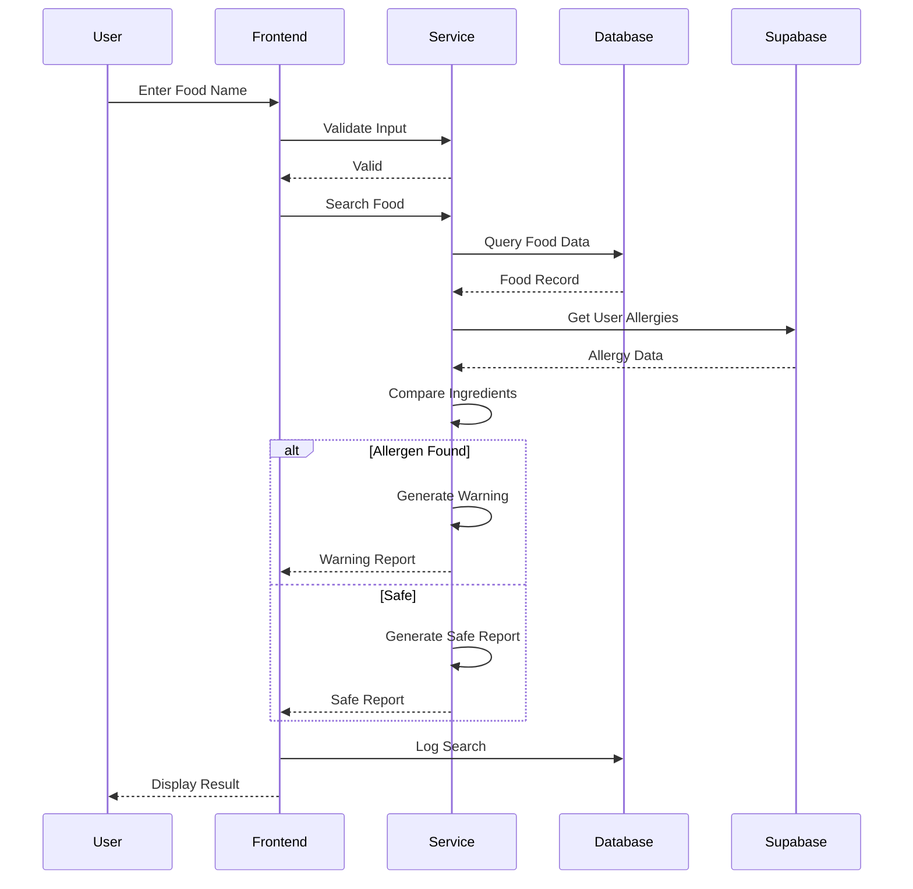

## 12. Deployment Architecture Diagram

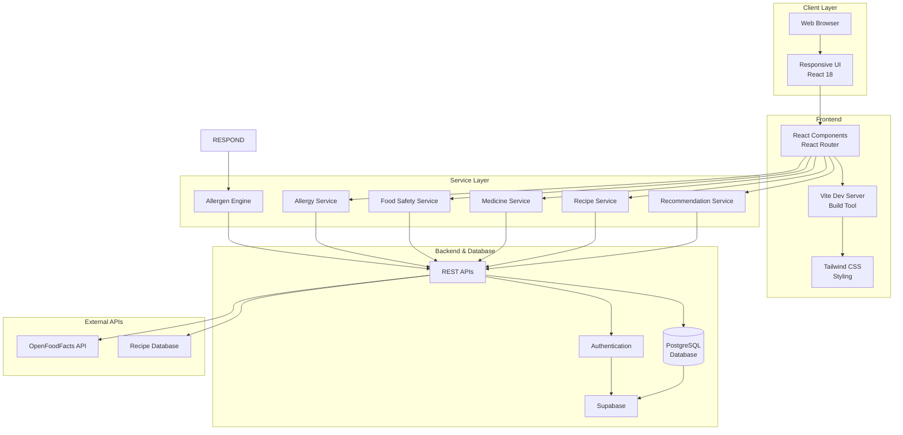

## How to Use These Mermaid Diagrams:

### Option 1: Mermaid Live Editor
- Go to [Mermaid Live Editor](https://mermaid.live)
- Copy any diagram code (starting with ```mermaid)
- Paste into the editor
- Export as PNG/SVG

### Option 2: GitHub Markdown
- Paste directly into .md files
- GitHub will automatically render them

### Option 3: VS Code with Mermaid Extension
- Install "Markdown Preview Mermaid Support"
- Preview .md files in VS Code
- Diagrams render automatically

### Option 4: Include in LaTeX Report
```latex
% In your LaTeX document
\begin{figure}[h!]
  \centering
  \includegraphics[width=0.9\textwidth]{safebite-flowchart.png}
  \caption{SafeBite Main System Flowchart}
\end{figure}
```

---

**Export Instructions:**
1. Open Mermaid Live Editor
2. Paste diagram code
3. Click "Download" 
4. Choose PNG or SVG format
5. Insert into LaTeX report
